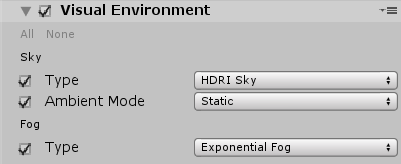

# Visual Environment

The Visual Environment Volume component override specifies the **Sky Type** and **Fog Type** that HDRP renders in the Volume.

## Using the Visual Environment

The **Visual Environment** uses the [Volume](Volumes.html) framework, so to enable and modify **Visual Environment** properties, you must add a **Visual Environment** override to a [Volume](Volumes.html) in your Scene.

The **Visual Environment** override comes as default when you create a **Scene Settings** GameObject (Menu: **GameObject > Rendering > Scene Settings**). You can also manually add a **Visual Environment** override to any [Volume](Volumes.html). To add **Visual Environment** to a Volume:

1. In the Scene or Hierarchy view, select a GameObject that contains a Volume component to view it in the Inspector.
2. In the Inspector, navigate to **Add Override** and click on **Visual Environment**. You can now use the **Visual Environment** override to control the sky and fog for this Volume.

## Properties

### Sky

| **Property**     | **Description**                                              |
| ---------------- | ------------------------------------------------------------ |
| **Type**         | Use the drop-down to select the type of sky that HDRP renders when this Volume affects the Camera that is inside the Volume. This list automatically updates when you create a custom Sky.  &#8226; **None**: HDRP does not render a sky for Cameras in this Volume. &#8226; [Gradient Sky](Override-Gradient-Sky.html): Renders the top, middle, and bottom sections of the sky using three separate color zones. HDRP controls the size of these color zones using the Gradient Sky’s **Gradient Diffusion** property. &#8226; [HDRI Sky](Override-HDRI-Sky.html): Uses a cubemap texture to represent the entire sky. &#8226; [Procedural Sky](Override-Procedural-Sky.html): Generates a sky based on properties such as, **Sky Tint**, **Ground Color**, and **Sun Size**. |
| **Ambient Mode** | Use the drop-down to select the mode this Volume uses to process ambient light. &#8226; **Static**: Ambient light comes from the baked sky assigned to the **Static Lighting Sky** property in the Lighting window. This light affects both real-time and baked global illumination. For information on how to set up environment lighting, see the [Environment Lighting documentation](Environment-Lighting.html#BakingEnvironment). &#8226; **Dynamic**: Ambient light comes from the sky that is set in the **Sky** > **Type** property of this override. This means that ambient light can change in real time depending on the current Volume affecting the Camera. If you use baked global illumination, changes to the environment lighting only affect GameObjects exclusively lit using Ambient Probes. If you use real-time global illumination, changes to the environment lighting affect both lightmaps and Ambient Probes. |

### Fog

| **Property** | **Description**                                              |
| ------------ | ------------------------------------------------------------ |
| **Type**     | The type of sky that HDRP renders when this Volume affects the  Camera. This list automatically updates when you write a new custom fog. &#8226; **None**: HDRP does not process fog for Cameras in this Volume. &#8226; [Linear Fog](Override-Linear-Fog.html): Produces fog that gets more dense linearly with distance from the Camera. &#8226; [Exponential Fog](Override-Exponential-Fog.html): Produces fog that gets more dense exponentially with distance from the Camera. &#8226; [Volumetric Fog](Override-Volumetric-Fog.html): Produces fog that interacts with light realistically to allow for physically plausible rendering. |

## Changing sky settings

After you have set your **Sky Type** and **Fog Type**, if you want to override the default settings, you need to create an override for them on the Volume. For example, if you set the **Sky Type** to **Gradient Sky**, click **Add component overrides** on your Volume and add a **Gradient Sky** override. Then you can disable, or remove, the **Procedural Sky** override because the Visual Environment ignores it and uses the **Gradient Sky** instead. To disable the override, disable the checkbox to the left of the **Procedural Sky** title . To remove the override, click the drop-down menu to the right of the title and select **Remove** .

On the [Gradient Sky](Override-Gradient-Sky.html) override itself, you can enable the checkboxes next to each property to override the property with your own values. For example, enable the checkbox next to the **Middle** property and use the color picker to change the color to pink.

